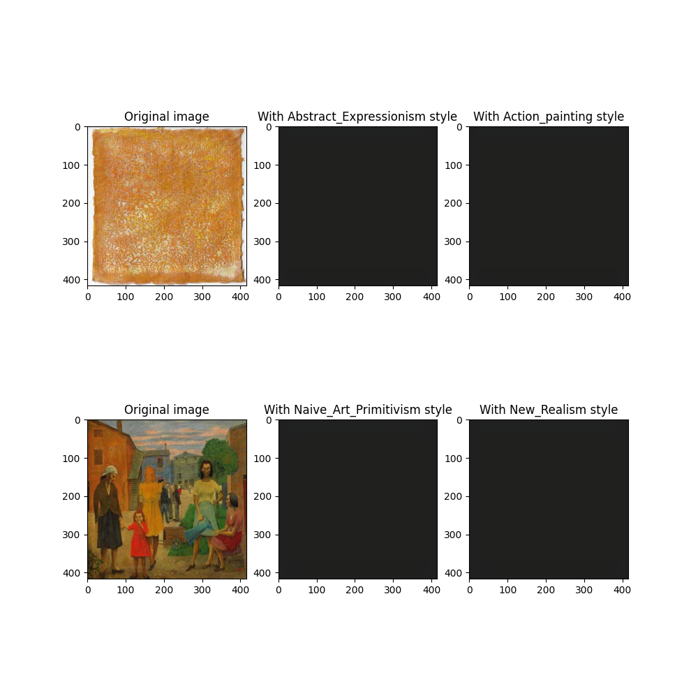

# WikiArt classification 

This repository details my solution for assignment 2 of LT2926 at the University of Gothenburg (Machine learning for statistical NLP: advanced), exploring autoencoders and image generation for Wikiart data.

I used the provided codebase as a starting point to (hopefully!) make it easier to follow for marking: https://github.com/asayeed/lt2326-h24-wa_modeling

## Assignment
### Bonus A - Make the in-class example actually learn something

I made the following changes to the architecture and training:
- Trained for 20 epochs.
- Changed batch size to 64.
- Decreased the learning rate to 0.001.
- Added two conv/dropout/relu layers.
- Changed the size of the final Linear layer to 100 (this was necessary to complete my answer to part 3).

I also fixed the bug in the original test.py code that caused the class indexes to be shuffled every time the dataset was reloaded (see "Class indexes" towards the bottom of this document). I think this probably had the biggest impact: without it, every time the test script was run, the class indexes changed at random, meaning even if the model *was* predicting classes correctly, they were not being matched to the right class index in the test data and therefore it was being evaluated as an incorrect prediction. **I think this is probably why the in-class example did not 'learn' anything meaningful**. Note that without this fix, the test script returns a different accuracy every time it is rerun. With the fix, the accuracy is the same every time (as we would expect). 

With these changes the model achieved an accuracy of 0.115887850522995 i.e. 11%, so higher than the 5% requested. The training loss over time is below:


### Part 1 - Fix class imbalance

I decided to solve this by a mixture of upsampling and downsampling to bring all the classes in the training set to around 400 samples each:
- Where a class had too many samples, I randomly removed entries from the training data with a probability that meant we ended up with around 400 samples.
- Where a class had too few samples, I duplicated entries until the class reached 400 items in size. 

The details of my approach are below:

First I checked how many entries we had for each class:

```sh
$ find /scratch/lt2326-2926-h24/wikiart/train -type f | cut -d/ -f6 | sort | uniq -c | sort -nr
   2269 Impressionism
   1712 Realism
   1157 Romanticism
   1127 Expressionism
    946 Post_Impressionism
    721 Baroque
    688 Art_Nouveau_Modern
    679 Symbolism
    449 Abstract_Expressionism
    413 Northern_Renaissance
    390 Cubism
    373 Naive_Art_Primitivism
    369 Rococo
    268 Color_Field_Painting
    246 Mannerism_Late_Renaissance
    246 Early_Renaissance
    244 Pop_Art
    212 Minimalism
    198 High_Renaissance
    197 Ukiyo_e
    163 Fauvism
     91 Contemporary_Realism
     80 Pointillism
     41 New_Realism
     38 Synthetic_Cubism
     18 Action_painting
     15 Analytical_Cubism
```

I wanted to aim for 400 in the resample, so I divided 400 by the number of samples in the class. Where the number is less than 0, that's our resample probability; where it's greater than zero, that's how many times we need to duplicate each entry. 

```sh
$ find /scratch/lt2326-2926-h24/wikiart/train -type f | cut -d/ -f6 | sort | uniq -c | sort -nr | awk '{print 400/$1, $2}'
0.176289 Impressionism
0.233645 Realism
0.345722 Romanticism
0.354925 Expressionism
0.422833 Post_Impressionism
0.554785 Baroque
0.581395 Art_Nouveau_Modern
0.589102 Symbolism
0.890869 Abstract_Expressionism
0.968523 Northern_Renaissance
1.02564 Cubism
1.07239 Naive_Art_Primitivism
1.08401 Rococo
1.49254 Color_Field_Painting
1.62602 Mannerism_Late_Renaissance
1.62602 Early_Renaissance
1.63934 Pop_Art
1.88679 Minimalism
2.0202 High_Renaissance
2.03046 Ukiyo_e
2.45399 Fauvism
4.3956 Contemporary_Realism
5 Pointillism
9.7561 New_Realism
10.5263 Synthetic_Cubism
22.2222 Action_painting
26.6667 Analytical_Cubism
```

I used the numbers above to define a RESAMPLE_DICT in wikiart.py. With this dictionary, the new counts for each class are below. As you can see, this ends up at around 400 samples (give or take) for each class:

```sh
393 Expressionism
394 Ukiyo_e
389 Post_Impressionism
424 Minimalism
407 Romanticism
488 Pop_Art
410 Realism
268 Color_Field_Painting
405 Analytical_Cubism
390 Cubism
396 High_Renaissance
326 Fauvism
410 New_Realism
492 Early_Renaissance
364 Contemporary_Realism
418 Impressionism
369 Rococo
413 Northern_Renaissance
373 Naive_Art_Primitivism
396 Action_painting
400 Pointillism
449 Abstract_Expressionism
402 Art_Nouveau_Modern
418 Synthetic_Cubism
391 Baroque
382 Symbolism
492 Mannerism_Late_Renaissance
```

### Part 2 - Autoencode and cluster representations

To run this task, edit the "autoencoder" config in [config.json](./config.json) (to e.g. reduce the number of epochs) and then run `encodings.py`:
```sh
python3 encodings.py
```

N.b. you'll need to install seaborn, which is (surprisingly...) not installed in the mltgpu environment. You can do this with `pip install --user seaborn`.

I defined the autoencoder as `WikiArtAutoencoder` in wikiart.py. I split it into two parts:
- An encoder, which takes as input the image and uses progressive convolutional layers (followed by batch norm and dropout layers) to reduce the images from 3-channel 416x416 tensors to a 1-channel 10x10 tensor. **The 10x10 tensor output by the encoder is the model's compressed representation of the image.** 
- A decoder, which is the mirror image of the encoder. 

The autoencoder is trained in encodings.py. To track the training progress, I use the mean-squared error to compare how close the autoencoder's generated image is to the actual image.

After training the encoder for 100 epochs, the mean loss per epoch plateaus, but is still fairly high: 


(I forgot to properly label the x-axis again here, sorry - it goes from 0 to 99, with each tick representing the mean training loss for the epoch.)

I ran this trained model on the test dataset to get the encoder's compressed representation of each test image. I then flattened this representation (from 1x10x10 to 1x100) and ran PCA on it to plot the representations in 2D space. As you can see from the plot below, art styles do not cluster well in my model:

. 


### Part 3 - Generation/style transfer 

To run this task, edit the "style_embeddings" config in [config.json](./config.json) (to e.g. reduce the number of epochs) and then run `encodings_with_style_embeddings.py`:
```sh
python3 encodings_with_style_embeddings.py
```

Note that this MUST be run on the CPU for reasons explained in [implementation challenges](#implementation-challenges) below. 

#### Solution

We have already trained a model to classify art styles at the start of this assignment. We can use the second-to-last layer of this model (before bringing the number of dimensions down to equal the number of classes) as a learned embedding for the art style. I altered the architecture slightly to make this output be 1x100 in size to make it easier to integrate into the autoencoder. 

After training the art style model, I run it again over all the items in the training set to find the mean embedding per class (`generate_class_embeddings` in `encodings_with_style_embeddings.py`). This becomes the representation of the art style which I pass to the autoencoder. 

To integrate the art style into the autoencoder, I perform the following steps. Recall that the art style embedding is 1x100 and the output of the encoder is 1x10x10. I flatten the output of the encoder to 1x100 and concatenate it with the art style embedding to get a tensor of size 1x200. I then apply a trained linear transformation on this to reduce its dimensionality to 1x100, and resize it to 1x10x10. This creates a new hidden layer which is then passed to the decoder. 

Because of issues getting the implementation working on the GPU (see below), I could only run this model on the CPU. I didn't want to hog the CPU so close to the deadline for the final project so I only trained the model for 20 epochs to check it worked. The training loss is below:


For the requested output, I sampled two images from the test set and looked at what happened if I ran the model on the image with the correct art style, and with a different art style. The output, as expected given I only trained for a small number of epochs, is not at all meaningful:



I think if you wanted to improve the performance of this model you'd want to:
1. Make the style embeddings more meaningful by improving the performance of the style classifier (e.g. trying a more complicated architecture). 
2. Train for more epochs - judging from the training loss over time, 20 was too few, so I'd want to try closer to 100 (but running on the GPU, not the CPU!). 

#### Implementation challenges

**Class indexes**.

I realized while doing this task that the class indexes change between runs. This happens because:
1. os.walk is used to iterate through the input directory, but os.walk doesn't preserve order; on each pass, the order in which a class is seen will change. 
2. set() is used to store the classes rather than dict(), and sets do not preserve insertion order. 

I fixed this by (1) ordering the outputs of os.walk before using them, and (2) altering the class save logic to use a dict() (Python 3.12.3 is the default Python version on the server, so the dictionary will preserve insertion order).

This fix also meant I could correctly evaluate the performance of the model for Bonus A. 

**Model training**. 

In `generate_class_embeddings`, I got an out-of-memory error when training on the GPU. I tried everything I could think of (reducing batch size down to 1, deleting unused variables at the end of each step/batch, forcing CUDA to empty the cache, optimizing the code to minimize what needs to be held in memory) but it still crashed. In the end I suspected this was the culprit:

```py
embeddings_for_cls[cls_idx] = embedding + embeddings_for_cls[cls_idx]
```

I suspected Torch was building a graph that meant all the tensors had to be held in memory for the final embeddings dictionary. I changed this to detach the tensor, reasoning that removing it from the computing graph entirely would mean that Torch/Python could better manage the memory:

```py
embeddings_for_cls[cls_idx] = embedding.detach() + embeddings_for_cls[cls_idx]
```

And this did stop the class embeddings step from running out of memory. However, I then ran into an error in the autoencoder training itself:

```
File "/home/gusandmich@GU.GU.SE/assignment_2/wikiart-classification/wikiart.py", line 206, in forward
    linear = nn.Linear(200, 100)(concatted)  # [batch_size, 100]
[...]
RuntimeError: Expected all tensors to be on the same device, but found at least two devices, cpu and cuda:<number>! 
```

And this persisted even if I forced all the steps to be on the cuda device (with `.to(device)`), so the only way I could get the model to run is if it's run on CPU. The only other theory I had was that maybe the problem was to do with splitting the forward layer into two branches with the 'if' statement, or because I didn't wrap the embedding logic in an `nn.Sequential` (but I don't see how you'd do this, given there's a concatenation involved), but I don't know how to fix that if it's the case. 

I would love to hear ideas as to why this is happening! 

### Bonus B 

I didn't have time for this because I spent so long trying to get Part 3 running on the GPU :( Maybe I'll have a go if I finish the final assignment writeup early (unlikely). 